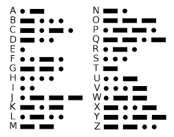

# Tapping
## AUTHOR: DANNY

### Description:
Theres tapping coming in from the wires. What's it saying ```nc jupiter.challenges.picoctf.org 48247.```

## 1. Knowledge

### 1. Morse code 
Morse code includes dashes and dots. One dot represents one time unit, and one dash represents three dots.


## 2. Solution:
This tool will help you: [kt.gy](https://kt.gy/tools.html#conv/)

<p align="center">
  
</p>

---

minhchi
