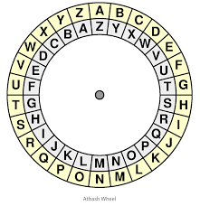

# rotation
## AUTHOR: LOIC SHEMA

### Description:
You will find the flag after decrypting this file
Download the encrypted flag [here](https://artifacts.picoctf.net/c/391/encrypted.txt).

## 1. Knowledge

- In Rot algorithm shift number can be any number from 0 to 25.

- RotN, where N denotes the shift number.

- Rot13 algorithm is a special variant, where shift-right (encryption) and shift-left (decryption) both gives the same output.

    

I think it's easy: I have 2 circles with the same index, rot1 $\to$ rotate 1 shift, rot2 $\to$ rotate 2 shifts,... 

## 2. Solution:
This tool will help you: [kt.gy](https://kt.gy/tools.html#conv/)

  

---

minhchi
