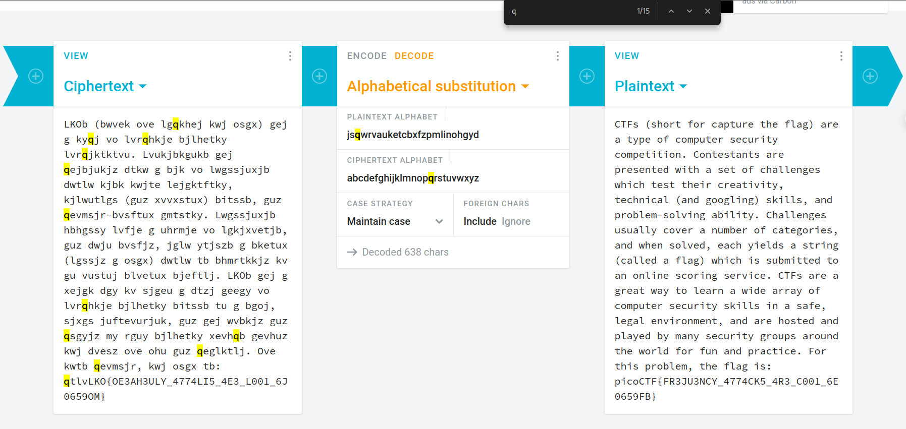

# substitution1
## AUTHOR: WILL HONG

### Description:
A second message has come in the mail, and it seems almost identical to the first one. Maybe the same thing will work again.

Download the message [here](https://artifacts.picoctf.net/c/183/message.txt).

## 1. Solution:

Using this tool: [Boxentriq](https://www.boxentriq.com/code-breaking/rail-fence-cipher)

hmm, i found the flag: ```picoCTF{FR3JU3NCY_4774CK5_4R3_C001_6E0659FB}```, but the flag submission is incorrect.

```FR3JU3NCY```  I think it should be ```FR3QU3NCY```, but considering the incorrect context before, I will double-check.



Using this tool [cryptii](https://cryptii.com/pipes/alphabetical-substitution) and I discovered that the letter ```q``` is not included in the plaintext, so we can swap ```j``` to ```q```.

<p align="center">
  
</p>

---

minhchi
