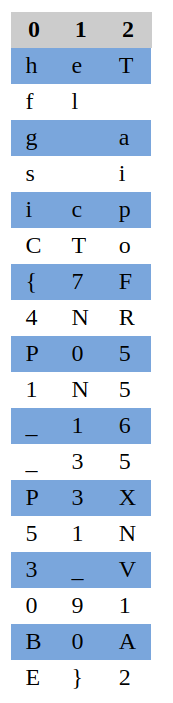

# transposition-trial
## AUTHOR: WILL HONG

### Description:
Our data got corrupted on the way here. Luckily, nothing got replaced, but every block of 3 got scrambled around! The first word seems to be three letters long, maybe you can use that to recover the rest of the message.
Download the corrupted message [here](https://artifacts.picoctf.net/c/192/message.txt).

## 1. Solution:

Using this tool: [tholman](https://tholman.com/other/transposition/) with Key length = 3.



Hmm, the rule is ```2 -> 0 -> 1```. Write it down on paper and get the flag.

---

minhchi
