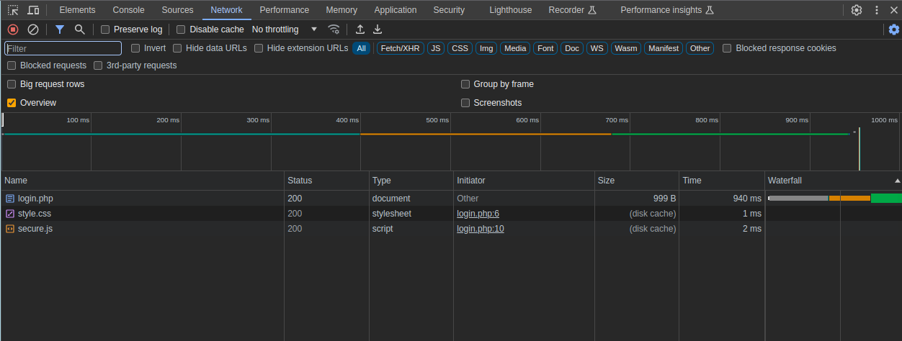

# Local Authority
## AUTHOR: LT 'SYREAL' JONES

### Description:
Can you get the flag?
Go to this [website](http://saturn.picoctf.net:50920/) and see what you can discover.

#### 2. Solution
Enter your random **Username** and **Password**. Of course, you will fail.
```
Log In Failed
```
Hmm, we can check what the server responded to me:



What does file ```secure.js``` contain?
```js
function checkPassword(username, password){
    if (username === 'admin' && password === 'strongPassword098765') {
        return true;
    } else {
        return false;
    }
}
```
Opp~ ??, :v 


#### 3. How to login?

This challenge has solution in file ```secure.js```, but we want know how does the password checked on this website?

If you inspect the HTML, you will see the function that decodes your **username** and **password**:
```js
function filter(string) {
    filterPassed = true;
    for (let i =0; i < string.length; i++){
        cc = string.charCodeAt(i);
        if ((cc >= 48 && cc <= 57) || (cc >= 65 && cc <= 90) || (cc >= 97 && cc <= 122)) {
            filterPassed = true;     
        } else {

            return false;
        }
    }
        
    return true;
}
```
My random username and password will be parameters of the filter, and the function will check which characters satisfy the criteria:
+ 48 $\to$ 59: 0 $\to$ 9
+ 65 $\to$ 90: A $\to$ Z
+ 97 $\to$ 122: a $\to$ z

Oh, the filter function will check the password and username in [A-z0-9] characters. (:>, initially, I assumed it would decode the password and username). So, the password and username are the key for Flag (yay~)

<p align="center">
    
</p>

---

minhchi