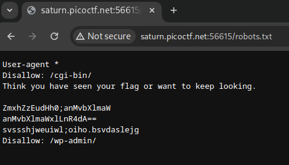
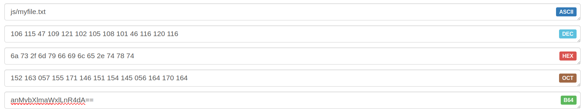

# Roboto Sans
## AUTHOR: MUBARAK MIKAIL

### Description:
The flag is somewhere on this web application not necessarily on the website. Find it.
Check [this](http://saturn.picoctf.net:56615/) out.

## Knowledge
#### 2. What is robots.txt?

It's a text file with instructions for bots (search engine) trying to access a website.

- user-agent: denotes the name of the crawler (the names can be found in the Robots Database)

- disallow: prevents crawling of certain files, directories or web pages

- allow: overwrites disallow and allows crawling of files, web pages, and directories

- sitemap (optional): shows the location of the sitemap

- *: stands for any number of character

- $: stands for the end of the line

## 2. Solution

Try to find robots.txt with URL ```/robots.txt``` and the result:



Encript with base64:


Yay, :v, try ```js/myfile.txt``` to get flag.

---

minhchi