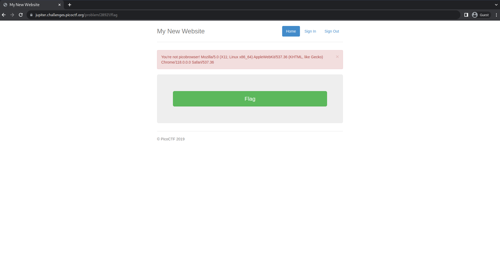

# picobrowser
## AUTHOR: ARCHIT

### Description:
This website can be rendered only by **picobrowser**, go and catch the flag!

### 1. Knowledge
#### 1.1 Request Headers
It justs key:value, **key:value** pair helps server understand more about the request that client has placed.

_Example_: 
| Header Parameters     | Description |
| ----------- | ----------- |
| Host      | www.abc.com       |
| User-agent   | WebSniffer/1.0  |
| Referer | https://websniffer.co |
| Connection | Close |
| Accept-Language |en-US |
| Accept-Encoding | gzip |

Hiểu một cách đơn giản, đó là thông tin về client gửi lên server và trình duyệt và server sẽ dựa vào các thông số này để trả dữ liệu phù hợp (ở mục Accept-Language hoặc Accept-Encoding ở trên).

### 2. Solution
1. Enter link:

    

2. Using Postman to check:

    

3. Change: **User-agent: picobrowser**

    

:v, and get flag...